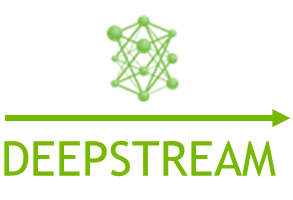

# DeepStream Human Pose Estimation

Human pose estimation is the computer vision task of estimating the configuration (‘the pose’) of the human body by localizing certain key points on a body within a video or a photo. The following application serves as a reference to deploy custom pose estimation models with DeepStream 5.0 using the [TRTPose](https://github.com/NVIDIA-AI-IOT/trt_pose) project as an example. 

  


## Prerequisites
You will need 
1. DeepStreamSDK 5.0
2. CUDA 10.2
3. TensorRT 7.x


## Getting Started:
To get started, please follow these steps.
1. Install [DeepStream](https://developer.nvidia.com/deepstream-sdk) on your platform, verify it is working by running deepstream-app.
2. Clone the repository preferably in `$DEEPSTREAM_DIR/sources/apps/sample_apps`.
2. Download the TRTPose [model](https://github.com/NVIDIA-AI-IOT/trt_pose), convert it to ONNX using this [export utility](https://github.com/NVIDIA-AI-IOT/trt_pose/blob/master/trt_pose/utils/export_for_isaac.py), and set its location in the DeepStream configuration file.
3. Replace the OSD binaries (x86 or Jetson) in `$DEEPSTREAM_DIR/libs` with the ones provided in this repository under `bin/`.
4. Compile the program
 ```
  $ cd deepstream-pose-estimation/
  $ sudo make
  $ sudo ./deepstream-pose-estimation-app <file-uri> <output-path>
```

5. If you do not already have a .trt engine generated from the ONNX model you provided to DeepStream, an engine will be created on the first run of the application. Depending upon the system you’re using, this may take anywhere from 4 to 10 minutes.

6. The final output is stored in 'output-path' as `Pose_Estimation.mp4`

## References
Cao, Zhe, et al. "Realtime multi-person 2d pose estimation using part affinity fields." Proceedings of the IEEE Conference on Computer Vision and Pattern Recognition. 2017.

Xiao, Bin, Haiping Wu, and Yichen Wei. "Simple baselines for human pose estimation and tracking." Proceedings of the European Conference on Computer Vision (ECCV). 2018.
